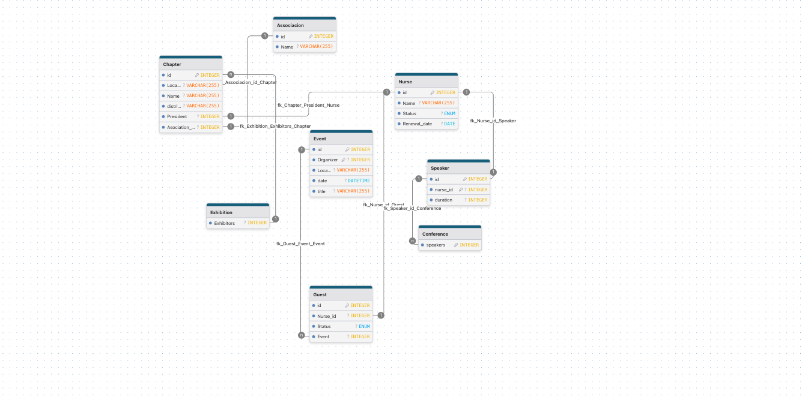

# Nurses Association Database Management System

A comprehensive Spring Boot application for managing nurses associations, chapters, events, and member data. This project serves as an Enterprise Java Development exercise demonstrating modern Java enterprise patterns and best practices.

## 📋 Table of Contents

- [Project Overview](#project-overview)
- [Features](#features)
- [Technology Stack](#technology-stack)
- [Database Schema](#database-schema)
- [Prerequisites](#prerequisites)
- [Installation & Setup](#installation--setup)
- [Configuration](#configuration)
- [Running the Application](#running-the-application)
- [Project Structure](#project-structure)
- [API Documentation](#api-documentation)
- [Contributing](#contributing)
- [License](#license)

## 🎯 Project Overview

This application manages a comprehensive database system for nurses associations, providing functionality to:

- Manage nurse associations and their local chapters
- Track individual nurse memberships and renewal status
- Organize conferences and exhibitions
- Handle event speakers and exhibitors
- Manage guest lists and attendance tracking

The system supports a hierarchical structure where associations contain multiple chapters, each with their own president and events.

## ✨ Features

- **Association Management**: Create and manage nurses associations
- **Chapter Administration**: Handle local chapters with geographic organization
- **Nurse Registry**: Track nurse information, status, and membership renewals
- **Event Management**: Organize conferences and exhibitions
- **Speaker Management**: Manage conference speakers and their presentations
- **Guest List Management**: Track event attendance and RSVP status
- **Database Integration**: Full MySQL integration with JPA/Hibernate

## 🛠 Technology Stack

- **Java 17** - Programming language
- **Spring Boot 3.5.4** - Application framework
- **Spring Data JPA** - Data persistence layer
- **Hibernate** - ORM framework
- **MySQL** - Database management system
- **Maven** - Build and dependency management
- **Lombok** - Code generation library
- **Spring Boot DevTools** - Development utilities

## 📊 Database Schema

### Entity Relationship Diagram



*Database relationship diagram showing the complete entity model*

### Core Entities

#### Association
- `idAssociation` (Primary Key)
- `nameAssociation`
- List of chapters

#### Chapters
- `idChapter` (Primary Key)
- `nameChapter`
- `location`
- `district`
- `association` (Foreign Key)
- `president` (Nurse - Foreign Key)
- List of nurses

#### Nurse
- `idNurse` (Primary Key)
- `status` (ACTIVE/LAPSED)
- `renewalDate`

#### Event (Abstract Base Class)
- `EventId` (Primary Key)
- `title`
- `localization`
- `startDate`
- `organizer` (Chapter - Foreign Key)

#### Conferences (extends Event)
- List of speakers

#### Exhibitions (extends Event)
- List of exhibitor chapters

#### Speakers
- `id` (Primary Key)
- `nurse_id` (Foreign Key)
- `duration`
- `titleTalk`

#### Guest
- `id` (Primary Key)
- `nurse_id` (Foreign Key)
- `statusGuest` (Attending/Not_attending/No_response/Pending)

### Entity Relationships

```
Association (1) ←→ (N) Chapters (1) ←→ (1) Nurse (President)
                                 ↓
                             (1) ←→ (N) Events
                                       ↓
                    ┌─────────────────────┴─────────────────────┐
                    ↓                                           ↓
              Conferences (1) ←→ (N) Speakers           Exhibitions (1) ←→ (N) Chapters
                    ↓                    ↓                       ↓
              (1) ←→ (N) Guests    (1) ←→ (1) Nurse      (1) ←→ (N) Guests
```

## 📋 Prerequisites

Before running this application, ensure you have:

- **Java Development Kit (JDK) 17** or higher
- **MySQL Server 8.0** or higher
- **Maven 3.6** or higher (or use the included Maven wrapper)
- **Git** for version control

## 🚀 Installation & Setup

1. **Clone the repository**
   ```bash
   git clone https://github.com/afminguela/Enterprise-Java-Development-3.08.git
   cd Enterprise-Java-Development-3.08
   ```

2. **Navigate to the project directory**
   ```bash
   cd Nurses
   ```

3. **Set up MySQL Database**
   ```sql
   CREATE DATABASE NurseAssociation;
   CREATE USER 'your_username'@'localhost' IDENTIFIED BY 'your_password';
   GRANT ALL PRIVILEGES ON NurseAssociation.* TO 'your_username'@'localhost';
   FLUSH PRIVILEGES;
   ```

4. **Configure database connection** (see Configuration section)

5. **Build the project**
   ```bash
   ./mvnw clean install
   ```

## ⚙️ Configuration

Update the database configuration in `src/main/resources/application.properties`:

```properties
# Database Configuration
spring.datasource.url=jdbc:mysql://localhost:3306/NurseAssociation?createDatabaseIfNotExist=true
spring.datasource.username=your_username
spring.datasource.password=your_password
spring.datasource.driver-class-name=com.mysql.cj.jdbc.Driver

# JPA/Hibernate Configuration
spring.jpa.hibernate.ddl-auto=create-drop
spring.jpa.show-sql=true
spring.jpa.properties.hibernate.dialect=org.hibernate.dialect.MySQL8Dialect
```

### Configuration Options

- **`create-drop`**: Creates schema at startup, drops at shutdown (development)
- **`update`**: Updates existing schema (production)
- **`validate`**: Validates schema without changes (production)

## 🏃‍♂️ Running the Application

### Development Mode
```bash
./mvnw spring-boot:run
```

### Production Build
```bash
./mvnw clean package
java -jar target/Nurses-0.0.1-SNAPSHOT.jar
```

### Running Tests
```bash
./mvnw test
```

The application will start on `http://localhost:8080` by default.

## 📁 Project Structure

```
Nurses/
├── src/
│   ├── main/
│   │   ├── java/
│   │   │   └── com/afminguela/Nurses/
│   │   │       ├── NursesApplication.java          # Main application class
│   │   │       └── models/                         # Entity models
│   │   │           ├── Association.java           # Association entity
│   │   │           ├── Chapters.java              # Chapter entity
│   │   │           ├── Nurse.java                 # Nurse entity
│   │   │           ├── Event.java                 # Abstract event entity
│   │   │           ├── Conferences.java           # Conference entity
│   │   │           ├── Exhibitions.java           # Exhibition entity
│   │   │           ├── Speakers.java              # Speaker entity
│   │   │           ├── Guest.java                 # Guest entity
│   │   │           ├── StatusEnum.java            # Nurse status enumeration
│   │   │           └── StatusGuest.java           # Guest status enumeration
│   │   └── resources/
│   │       └── application.properties              # Application configuration
│   └── test/
│       └── java/
│           └── com/afminguela/Nurses/
│               └── NursesApplicationTests.java     # Test classes
├── pom.xml                                         # Maven configuration
└── README.md                                       # Project documentation
```

## 📚 API Documentation

This application provides a REST API for managing the nurses association data. The main endpoints include:

- **Associations**: CRUD operations for nurse associations
- **Chapters**: Management of local chapters
- **Nurses**: Nurse registration and status management
- **Events**: Conference and exhibition management
- **Speakers**: Speaker assignment and talk management
- **Guests**: Event attendance tracking

*Note: Detailed API documentation will be available once REST controllers are implemented.*

## 🤝 Contributing

1. Fork the repository
2. Create a feature branch (`git checkout -b feature/amazing-feature`)
3. Commit your changes (`git commit -m 'Add some amazing feature'`)
4. Push to the branch (`git push origin feature/amazing-feature`)
5. Open a Pull Request

### Coding Standards

- Follow Java naming conventions
- Use Lombok annotations to reduce boilerplate code
- Write meaningful commit messages
- Include unit tests for new functionality
- Update documentation for any API changes

## 🔮 Future Enhancements

- [ ] REST API implementation
- [ ] Web-based user interface
- [ ] User authentication and authorization
- [ ] Email notifications for event updates
- [ ] Reporting and analytics dashboard
- [ ] Mobile application support
- [ ] Integration with external calendar systems
- [ ] Automated membership renewal reminders

## 📄 License

This project is part of the Enterprise Java Development course and is intended for educational purposes.

## 👥 Authors

- **afminguela** - *Initial work* - [GitHub Profile](https://github.com/afminguela)

## 🙏 Acknowledgments

- Iron Hack coding bootcamp for the project requirements
- Spring Boot community for excellent documentation
- Contributors to the open-source libraries used in this project
